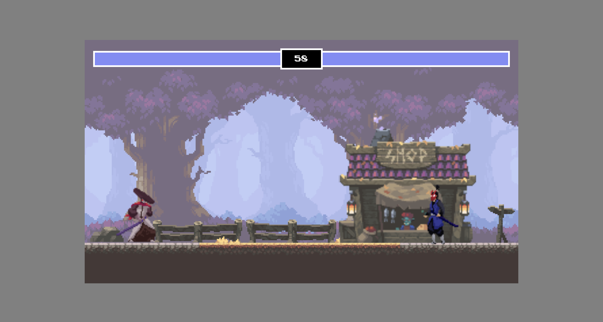
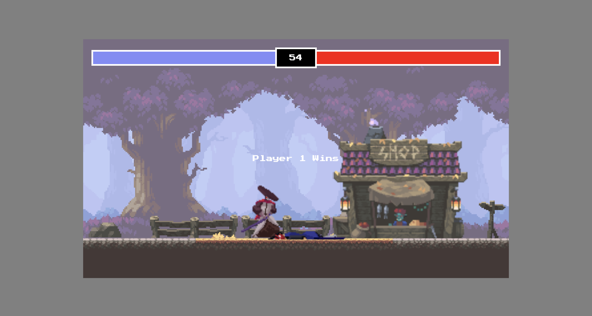

# JavaScript Fighting Game

這是一個基於 HTML Canvas 和 JavaScript 的簡單對戰遊戲，受到 Chris Courses 的 JavaScript Fighting Game Tutorial 影片啟發而製作，本人只在角色操作上多做了輕、重斬擊的差異並用 JQuery 來製作。

## 遊戲操作

### 玩家一 (Player 1)

- **w**: 向上跳
- **a**: 向左走
- **d**: 向右走
- **j**: 輕斬擊
- **k**: 重斬擊

### 玩家二 (Player 2)

- **↑**: 向上跳
- **←**: 向左走
- **→**: 向右走
- **8**: 輕斬擊
- **9**: 重斬擊

## 遊戲連結

[進入遊戲](https://kenlin1996.github.io/Fight-game/)

## 遊戲畫面

起始畫面：

結束畫面：

## 參考資源

- 特別感謝 Chris Courses 的 JavaScript Fighting Game Tutorial 影片：

  [https://www.youtube.com/watch?v=vyqbNFMDRGQ&t=12882s](https://www.youtube.com/watch?v=vyqbNFMDRGQ&t=12882s)

- 特別感謝 Oak Woods 提供的素材：

  [https://brullov.itch.io/oak-woods](https://brullov.itch.io/oak-woods)

- Fighter Asset #1: [https://luizmelo.itch.io/martial-hero](https://luizmelo.itch.io/martial-hero)

- Fighter Asset #2: [https://luizmelo.itch.io/martial-hero-2](https://luizmelo.itch.io/martial-hero-2)
